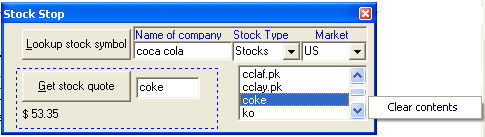



## StockQuote\.ocx \}\{ activeX control that  \(1\) get stock prices  \(2\) does stock symbol lookup

### Description

StockQuote.ocx }{ activeX control that (1) get stock prices (2) does stock symbol lookup
 
### More Info
 

             |
---                |---
**Submitted On**   |2005-01-14 04:06:22
**By**             |[zoom2](https://github.com/Planet-Source-Code/PSCIndex/blob/master/ByAuthor/zoom2.md)
**Level**          |Intermediate
**User Rating**    |4.3 (26 globes from 6 users)
**Compatibility**  |VB 3\.0, VB 4\.0 \(16\-bit\), VB 4\.0 \(32\-bit\), VB 5\.0, VB 6\.0, VB Script, ASP \(Active Server Pages\) , VBA MS Access, VBA MS Excel
**Category**       |[Complete Applications](https://github.com/Planet-Source-Code/PSCIndex/blob/master/ByCategory/complete-applications__1-27.md)
**World**          |[Visual Basic](https://github.com/Planet-Source-Code/PSCIndex/blob/master/ByWorld/visual-basic.md)
**Archive File**   |[StockQuote1839681142005\.zip](https://github.com/Planet-Source-Code/zoom2-stockquote-ocx-activex-control-that-1-get-stock-prices-2-does-stock-symbol-lookup__1-58274/archive/master.zip)

